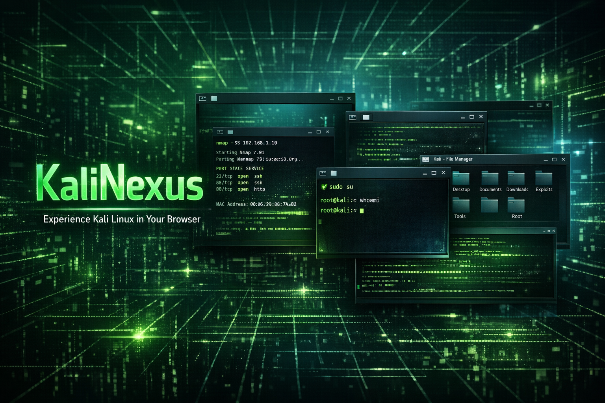
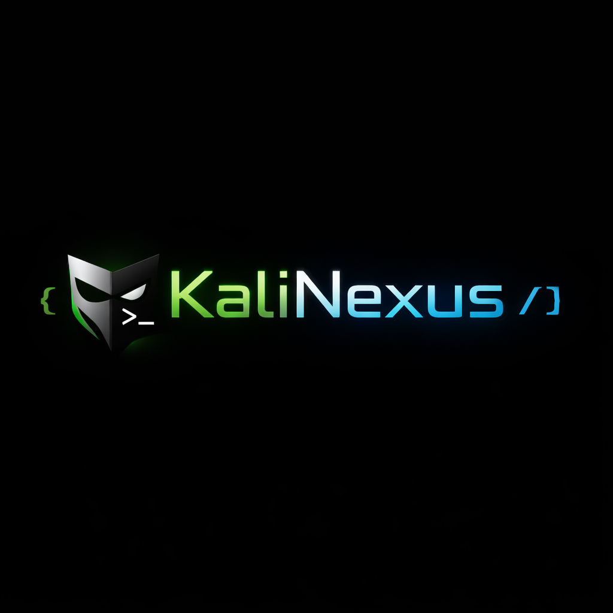
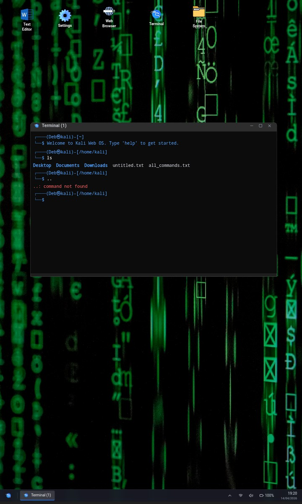

<!-- 🔥 KALINEXUS MASTERPIECE README -->

  

  

<h1 align="center">KaliNexus</h1>

  ⚡ Experience Kali Linux in your browser — anytime, anywhere, even offline

  <b>A next-gen browser-based OS simulator with real desktop + terminal experience</b>

---

🚀 Overview

KaliNexus is a powerful, browser-based operating system simulator inspired by real Linux environments.
It delivers a full desktop experience with terminal, file system, root access, and multi-window support — all inside your browser.

⚠️ This is a safe simulation — no real hacking or system access is performed.

---

✨ Features

- 🖥️ Full Desktop UI (Linux-style)
- 💻 Advanced Terminal Emulator
- 🔐 Root Access ("sudo su")
- 📂 Virtual File System
- 🪟 Multi Window System
- 🧩 Multi Terminal Tabs
- 🎨 Custom Background / Themes
- ⚡ Offline Support (App-like experience)
- 📱 Mobile Friendly
- 🎮 Future Gamification (Missions)

---

🧠 Core Systems

System| Description
Terminal Engine| Simulates Linux/Kali commands
File System| Virtual directories & files
Window Manager| Multi-window handling
Authentication| Login + root system
UI Engine| Desktop & interaction layer

---

⚙️ Installation

git clone https://github.com/deb-barman166/KaliNexus.git
cd KaliNexus

---

💻 Usage

🔑 Login

Username: kali
Password: kali

💀 Root Access

sudo su

🧠 Example Commands

ls
cd home
pwd
nmap
sqlmap

---

⚡ Versioning

🟢 v1.0.0

- Desktop UI
- Terminal (30+ commands)
- Login System
- Root Access

---

🔮 Roadmap

🔹 v1.1.0

- 100+ Commands
- File Explorer
- Multi Window

🔹 v1.2.0

- Multi Terminal Tabs
- Theme System
- Settings Panel

🔹 v2.0.0

- 🎮 Mission Mode
- 🤖 AI Terminal Assistant
- 📊 Hacking Dashboard

---

🎨 Mobile UI Preview

  

---

🔐 Disclaimer

- ❌ No real hacking
- ❌ No network attacks
- ❌ No system-level execution

✔️ Only simulation for learning & fun

---

🤝 Contributing

Contributions are welcome!

- Add commands
- Improve UI
- Create new features

---

💀 Author

Deb Barman

---

⭐ Support

If you like this project:

- ⭐ Star this repo
- 🍴 Fork it
- 📢 Share it

---

⚡ Final Words

«KaliNexus is not just a project —
it's a full operating system experience inside your browser.»

🔥 Build. Learn. Dominate.
